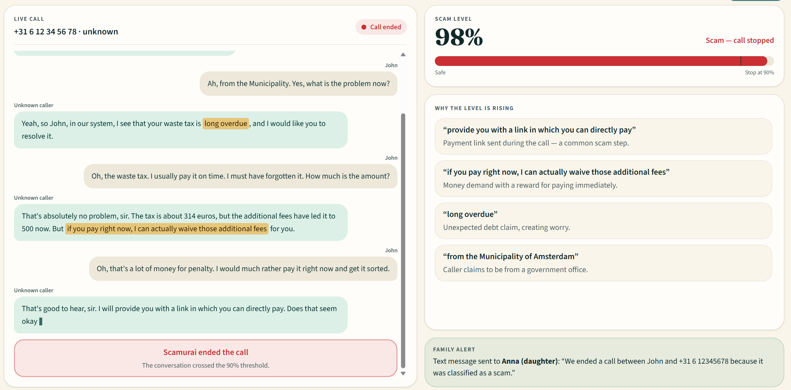

# Scamurai



Scamurai is a simulated live-call scam detector built with Next.js and a Nebius-hosted model. It streams a transcript line by line, classifies the rolling conversation in near real time, and flips into a red alert state when strong scam signals appear.

The app uses the Nebius model `Qwen/Qwen3-30B-A3B-Instruct-2507` because it gives a strong balance of instruction-following quality and demo-friendly responsiveness for structured JSON scoring.

## Scope

This is a transcript-driven demo, not a real telephony system. It simulates a live call by revealing pre-written transcript lines incrementally, so the product can show how scam-risk detection behaves in real time without live phone audio or STT.

## Local setup

1. Copy `.env.example` to `.env.local`.
2. Add your Nebius API key and select a valid model.
3. Install dependencies:

```bash
npm install
```

4. Start the app:

```bash
npm run dev
```

5. Open http://localhost:3000

## Demo flow

- Select a transcript from the dropdown.
- Click Start call.
- Watch the transcript reveal line by line.
- The app calls `/api/classify` on chunk boundaries and updates the risk meter.
- If the risk score crosses the scam threshold, the UI enters alert mode and pauses the reveal until resumed.

## Environment variables

Use `.env.local` with values like:

```env
NEBIUS_API_KEY=your_key_here
NEBIUS_MODEL_ID=Qwen/Qwen3-30B-A3B-Instruct-2507
CHUNK_LINE_COUNT=2
LINE_REVEAL_INTERVAL_MS=1500
SCAM_THRESHOLD=70
MIN_REQUEST_INTERVAL_MS=800
```

The real key is not committed; `.env.local` is ignored by git.

## Test Nebius directly

Run the standalone test against `transcripts/sample-call.txt`:

```bash
npm run test:nebius
```

It sends the same classifier prompt used by the app and prints the raw JSON response, request latency, token usage, and estimated cost when token rates are configured.

## Phase 8 metrics

The analysis panel records server request latency for each rolling transcript checkpoint, such as `Lines 1-2` or `Lines 1-4`. It keeps the latest eight measurements for the selected run.

The API also returns prompt and completion token counts when Nebius provides usage data. Estimated USD cost is shown only when both optional pricing variables are configured; no price is assumed by default:

```env
NEBIUS_INPUT_COST_PER_1M_TOKENS=
NEBIUS_OUTPUT_COST_PER_1M_TOKENS=
```

These metrics are estimates for the classification request and do not include other infrastructure costs.
